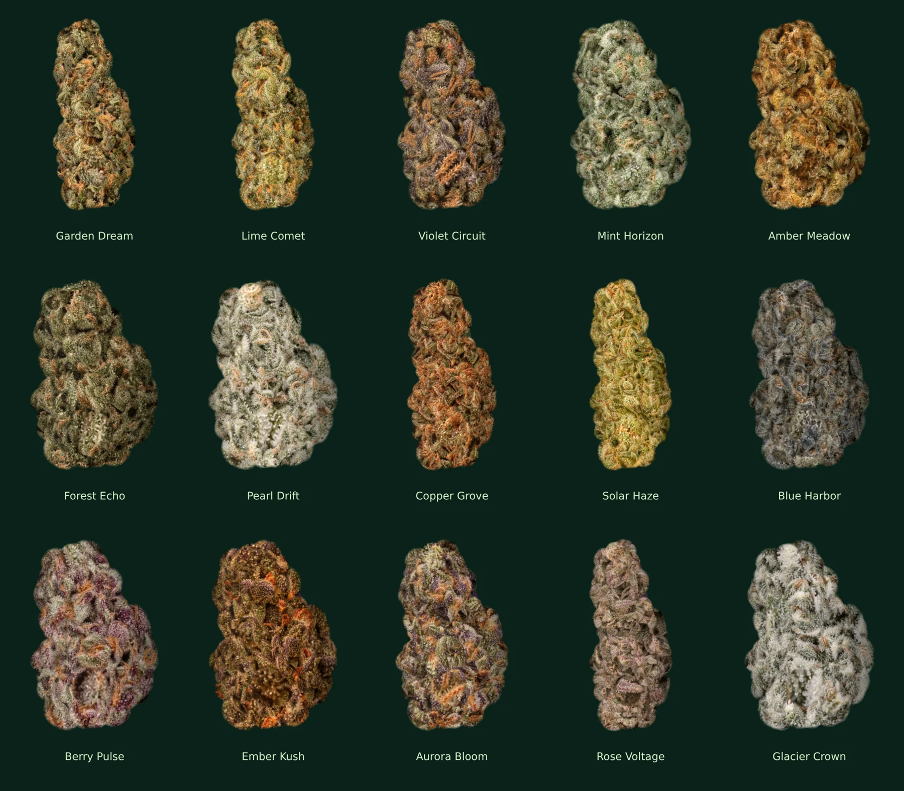

# V102 launch cultivars and material prompts

The launch catalog contains 15 base cultivars, each with four named phenotypes. `assets/cultivars.js` defines stable IDs, morphology and care multipliers, visual palette, material path and pack membership. Existing Dream, Comet and Violet profiles and material files remain compatible.

| Pack | Base cultivars | Available |
|---|---|---|
| Starter | Garden Dream, Lime Comet, Mint Horizon, Amber Meadow, Forest Echo | Immediately |
| Genetics | Violet Circuit, Pearl Drift, Copper Grove, Solar Haze, Blue Harbor | After Grow 1 |
| Exotic | Berry Pulse, Ember Kush, Aurora Bloom, Rose Voltage, Glacier Crown | After Grow 3 |

Packs contain three different base cultivars from their five-cultivar pool. Existing prices, rarity guarantees and unlock conditions are retained. Harvest seed drops and quick variants can use the complete catalog. The genetics screen lists every base cultivar, its defining character, pack family and discovery status. The collection phenotype denominator is now computed from the catalog (60).

## Material assets

The existing three materials remain under `assets/flowers/v101`. Twelve new transparent HD botanical sources were generated with the built-in image generation tool, one call per cultivar. Alpha-trimmed WebP exports preserve the generated transparency at quality 89. Full original PNG outputs were kept. New sources load on demand; the initial screen loads only the original three. A per-material loaded check prevents caching empty interim images, and load events repaint seed, hero and jar previews.

These sources supply small interior calyx/resin texture regions. The renderer builds each final silhouette independently from cultivar morphology, seed, phenotype and harvest conditions. Adding fifteen materials does not turn the renderer into a fixed fifteen-bud sprite library.

## Prompt set (built-in tool mode)

Shared prompt, followed by the cultivar-specific sentence in the table below:

Use case: product-mockup. Asset type: HD botanical material source for Ganjarium game. One single photorealistic dried cannabis flower cutout photographed with a focus-stacked macro lens. Complete subject inside frame with 12 percent transparent margin. Dense natural irregular calyx clusters, intricate granular frosty trichome texture, short curled hairs rooted in the bracts, few tiny tightly trimmed sugar leaves. Soft neutral studio light from upper left. Realistic restrained botanical colors, high sharpness. Genuinely transparent alpha background. No text, labels, jar, grid, detached fragments, floating tips, floor shadow, plastic scales, cartoon, pinecone pattern or chroma fringe. Portrait composition, flower occupies 75 percent of height. 

| ID / saved path | Material prompt | Morphology prompt |
|---|---|---|
| `assets/flowers/v102/mint-hero.webp` | Cultivar Mint Horizon. Color/material: cool pale mint and sage green bracts, thin ivory frost, sparse fine apricot hairs, fresh cool botanical hue. | Morphology: broad softly rounded flower with finely packed small calyces. |
| `assets/flowers/v102/amber-hero.webp` | Cultivar Amber Meadow. Color/material: warm olive and straw gold bracts, abundant amber and honey orange curled pistils, subtle cream resin. | Morphology: dense chunky irregular flower with large swollen calyces. |
| `assets/flowers/v102/forest-hero.webp` | Cultivar Forest Echo. Color/material: deep forest green and dark olive bracts, rust brown short pistils, moderate fine resin, rich earthy shadows. | Morphology: wide dense squat flower with coarse asymmetrical clusters. |
| `assets/flowers/v102/pearl-hero.webp` | Cultivar Pearl Drift. Color/material: pale sage bracts heavily encrusted with milky white trichomes, small faint peach pistils, nearly silver frosty macro surface. | Morphology: very dense compact lobed flower with tiny tightly packed bracts. |
| `assets/flowers/v102/copper-hero.webp` | Cultivar Copper Grove. Color/material: bronze olive bracts and sage folds, exceptionally dense fine copper red curled pistils interwoven with ivory resin. | Morphology: long uneven flower with irregular knobbly lateral clusters. |
| `assets/flowers/v102/solar-hero.webp` | Cultivar Solar Haze. Color/material: bright but natural yellow green and golden olive bracts, fine bright orange hairs, sparkling small white resin specks. | Morphology: elongated lightly open branching flower with slender irregular clusters. |
| `assets/flowers/v102/blue-hero.webp` | Cultivar Blue Harbor. Color/material: muted blue grey sage green with subtle slate indigo bract folds, white resin, small ochre orange hairs, realistic restrained botanical colors not cyan. | Morphology: broad asymmetrical dense flower with dark textured creases. |
| `assets/flowers/v102/berry-hero.webp` | Cultivar Berry Pulse. Color/material: dark berry plum and burgundy purple calyx surfaces interspersed with sage green bracts, abundant white frost and orange pistils. | Morphology: compact knobbly chunky flower with irregular large calyx clusters. |
| `assets/flowers/v102/ember-hero.webp` | Cultivar Ember Kush. Color/material: warm dark olive bracts with aubergine undertones, fiery burnt orange and red copper pistils, granular pale gold resin. | Morphology: very squat broad dense flower with swollen bumpy clustered bracts. |
| `assets/flowers/v102/aurora-hero.webp` | Cultivar Aurora Bloom. Color/material: mixed violet plum and moss green calyces with small golden bronze regions, pale frosty silver resin and copper orange hairs, natural variegation. | Morphology: wide irregular asymmetrical flower with protruding interconnected lobes. |
| `assets/flowers/v102/rose-hero.webp` | Cultivar Rose Voltage. Color/material: natural dusty mauve and muted rose purple calyx folds mixed with light sage green, pale cream frost, delicate warm amber hairs, no bright pink. | Morphology: tall slightly curved flower with fine sharply detailed dense bract clusters. |
| `assets/flowers/v102/glacier-hero.webp` | Cultivar Glacier Crown. Color/material: cool dark sage and pale grey green bracts under very thick bright ivory crystalline trichomes, very sparse dark copper pistils, frost white peaks. | Morphology: broad dense flower with small extremely resinous knobbly calyx clusters. |

## Verification

`tests/v102-cultivar-qa.mjs` verifies 15 independent material hashes and profile definitions; 60 unique phenotype names; five reachable cultivars per pack; no duplicate base cultivars within a pack; initial lazy loading; 60 connected rendered flowers and deterministic redraws; mobile catalog widths 320/393/430; actual pack purchases; and new exotic harvest persistence after reload and planting an Exotic Pack seed for the next grow. Its contact sheet compares all 15 flowers using the same seed so differences are visible beyond random seed variation.
